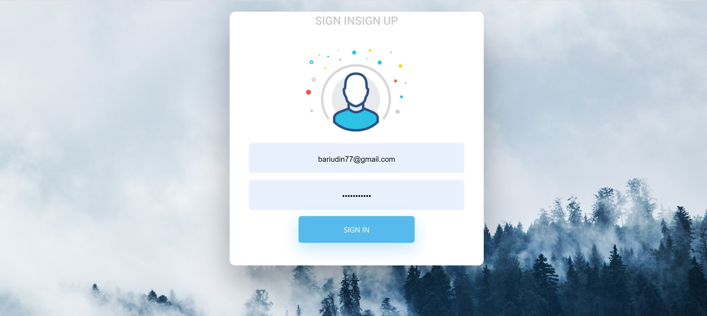
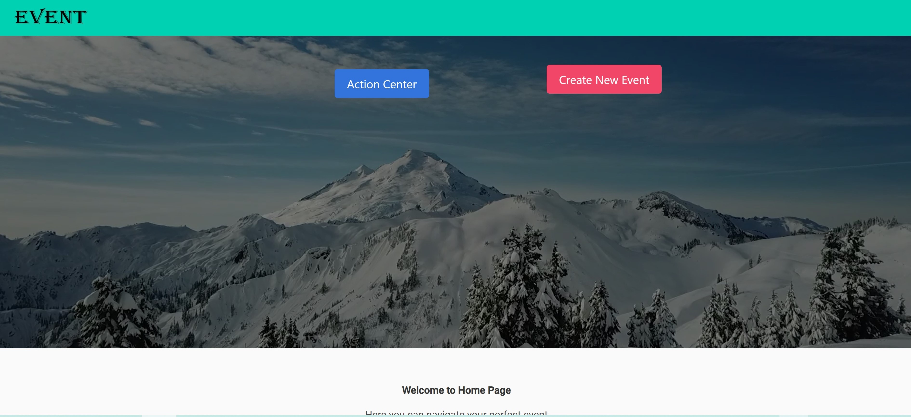
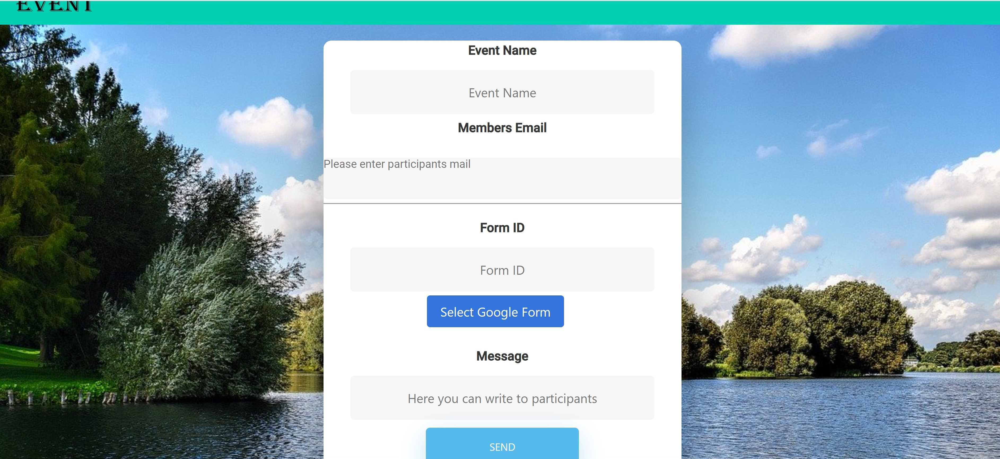

# EventApp
Mean stack app that generates event management system.
Used ML Recommendation collaborative filtering for user bases event recommendations
using Python.

# Login and sign up window

# Home page

# create new event window

### Hello, folks! 

<!-- Actual text -->

You can find me on : [![LinkedIn][2.2]][2].

<!-- Icons -->

[2.2]: https://raw.githubusercontent.com/MartinHeinz/MartinHeinz/master/linkedin-3-16.png (LinkedIn icon without padding)

<!-- Links to your social media accounts -->

[2]: https://www.linkedin.com/in/danielbariudin/
